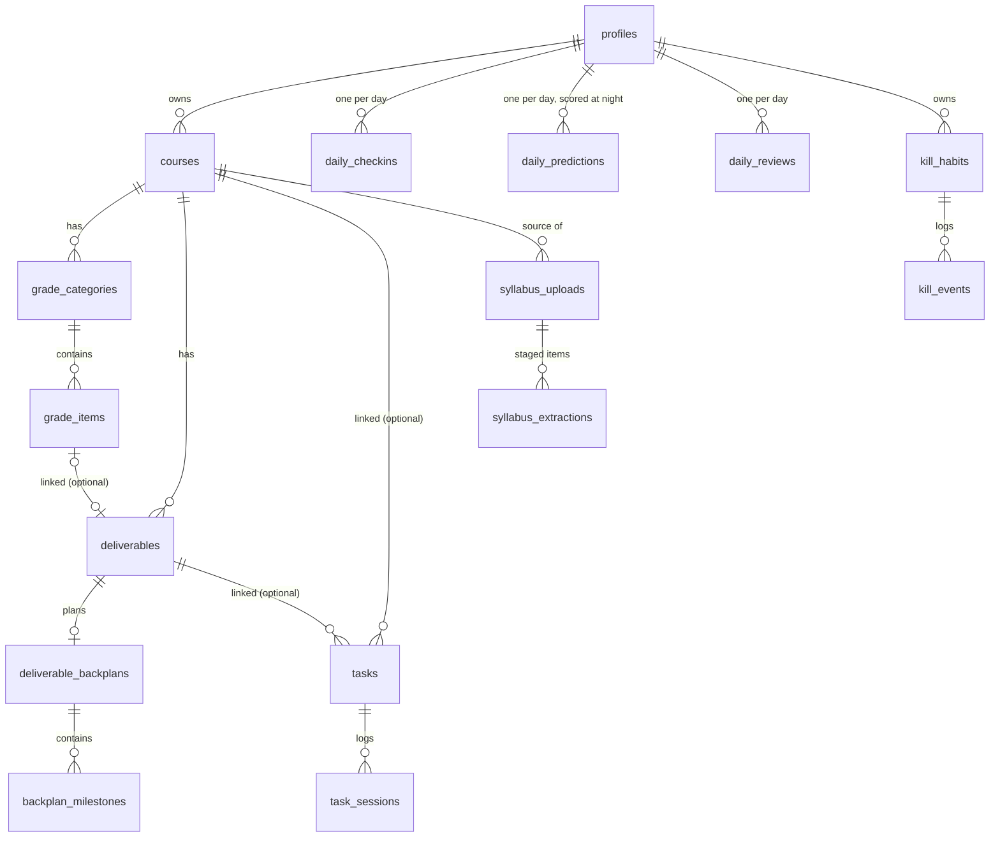

# CollegeOS — Data Model (L1)

> Authored by Eng A (ATLAS). Schema design, migrations, RLS, pgTAP, seed, and generated
> types all live in `supabase/` and `packages/api/src/database.types.ts`. This document is
> the reference: what each table is for, why it's shaped the way it is, and the handful of
> architectural rulings that apply across the whole schema.

---

## 0. The three rules this schema exists to enforce

1. **Postgres is the system of record.** Every fact CollegeOS reasons about — grades,
   deadlines, check-ins, telemetry — lives here first. `packages/core` reads rows and
   computes; it never invents state the database doesn't have.
2. **Every user-scoped table has RLS, no exceptions.** The anon/publishable key is a
   public value; an unprotected table is world-readable the moment it exists.
3. **Nothing an LLM extracts becomes real until a human confirms it.** The syllabus
   staging tables (§7) are the structural expression of this rule for academic deadlines,
   the highest-risk write path in the product.

---

## 1. Timezone: `local_date` is the load-bearing concept

CollegeOS is fundamentally about *local days* — a check-in, a deadline, a lapse. Getting
day boundaries wrong makes every downstream computation (bounce-back, risk proximity,
streaks) subtly wrong in a way that's easy to miss in testing and infuriating in
production.

- `profiles.timezone` is an IANA zone name (`America/Indiana/Indianapolis` by default —
  the demo user is a Purdue student), `NOT NULL`. Every `local_date` in this schema is
  ultimately anchored to this value.
- All instants are `timestamptz`. Never `timestamp without time zone`.
- `public.local_date(ts timestamptz, tz text) returns date` is the **one** function that
  converts an instant to a calendar day (`(ts at time zone tz)::date`). Every table that
  needs a day boundary either stores it directly (day-scoped tables, see below) or derives
  it through this function via a trigger — no other place in the schema is allowed to
  reimplement this conversion.
- **Computed at write time, never on read.** A trigger (or the app, for the five
  directly-day-scoped tables) calls `local_date()` once, at insert/update, and stores the
  result. This matters because a user's timezone can change mid-semester (studying abroad,
  moving) and history must stay anchored to the day it *actually happened in* — recomputing
  on read with the user's *current* timezone would silently rewrite the past.
- Two patterns for populating it:
  - **Direct input** for tables that are inherently day-scoped and have no natural driving
    instant: `daily_checkins`, `daily_predictions`, `daily_reviews`, `health_daily`,
    `screen_daily`. These carry `UNIQUE (user_id, local_date)` — one row per user per day —
    and the app supplies `local_date` directly, since the whole point of these tables is
    "today's record."
  - **Trigger-derived** for tables with a natural `occurred_at`/`due_at` instant:
    `deliverables.local_due_date` (via `deliverables_sync_local_due_date`), and
    `kill_events`, `friction_logs`, `decision_journal`, `telemetry_events` (all via the
    shared `sync_local_date_from_occurred_at()` trigger function, since they all share the
    `occurred_at -> local_date` column shape).
- **pgTAP-proven**, not just asserted: `supabase/tests/database/01_local_date_helper.test.sql`
  tests a DST spring-forward and fall-back transition in `America/Indiana/Indianapolis`
  (the hour where a hard-coded offset would silently pick the wrong day) and a user near
  the international date line in both directions (`Pacific/Kiritimati`, UTC+14, and
  `Pacific/Niue`, UTC-11 — where a "no offset exceeds ±12h" assumption breaks).

---

## 2. Enum policy

Postgres `ENUM` is reserved for closed sets we control that mirror a `packages/core`
TypeScript union and are **unlikely to churn**:

| Enum | Mirrors |
|---|---|
| `risk_band` | `packages/core`'s `RiskBand` |
| `confidence_level` | `packages/core`'s `Confidence` (risk/calibration/bounce-back) |
| `insight_confidence_level` | `packages/core`'s insight-gating `high\|medium\|testing` (deliberately a **separate** enum from `confidence_level` — they are different vocabularies with different meanings, and conflating them would be a real bug) |
| `commitment_level` | The L0-L4 escalation ladder, named rather than raw integers so the semantics are visible in every query and audit row |
| `friction_cause` | The brief's fixed list of failure reasons |
| `deliverable_type` | `packages/core`'s `DeliverableType` (`paper\|report\|problem_set\|exam\|project\|reading`) |

Everything else — `tasks.status`, `deliverables.status`, `syllabus_uploads.extraction_status`,
`syllabus_extractions.status`, `experiments.status`, `agent_reports.report_type`,
`oauth_connections.provider/status`, etc. — uses **`text` + `CHECK`**. These vocabularies
are expected to grow as UI flows get built during active development (a new task status,
a new extraction failure mode), and Postgres enums are easy to extend but painful to
shrink or reorder. When in doubt, the rule is: *if it's a contract with packages/core's
type system, enum; if it's an application-lifecycle status likely to gain values, text +
CHECK.*

---

## 3. Computed values: snapshots vs. live compute

**Current risk scores and grade projections are always recomputed live** by
`packages/core` from `courses`/`grade_categories`/`grade_items`/`deliverables` and never
read from a snapshot table. A snapshot is a *photograph*, and photographs go stale the
moment a grade is entered.

`risk_snapshots` and `grade_snapshots` exist for exactly one purpose: **historical trend**
("your BME risk has climbed for 5 days straight") — a question live computation cannot
answer because it has no memory of yesterday. They are written once per day by the
nightly job and are **append-only by construction**: neither table has an `UPDATE` or
`DELETE` RLS policy, so `FORCE ROW LEVEL SECURITY` denies both by default even for the
owning user. If you find yourself wanting to update a snapshot row, that's a sign you
wanted a new snapshot, not a fixed one.

`deliverable_backplans`/`backplan_milestones` are a **different kind of computed value**
and deliberately do NOT follow the snapshot pattern: a backplan is a schedule the user
interacts with (checking milestones off), not a trend metric. It is a live, mutable plan
that gets *replaced* (not accumulated) when capacity or inputs change meaningfully. Don't
add an `UPDATE`-denying policy to these two tables — that would break the product.

---

## 4. RLS strategy

Every user-scoped table:

- `alter table ... enable row level security` **and** `... force row level security` —
  FORCE matters because the owning role (`postgres` locally) is otherwise exempt, which
  would make local testing silently miss RLS bugs that only surface in production.
- A policy shaped `using ((select auth.uid()) = user_id) with check (same)` — the
  `(select auth.uid())` wrapping (not bare `auth.uid()`) is a Postgres RLS performance
  pattern: it lets the planner evaluate the function once instead of per row.
- An index on `user_id` (or the FK column policies filter on), since RLS predicates are
  just more WHERE-clause conditions and need the same index discipline as any other query.
- **Denormalized `user_id`**, even on tables whose ownership is technically indirect
  (`grade_items` belongs to a course, `task_sessions` belongs to a task,
  `backplan_milestones` belongs to a backplan belongs to a deliverable belongs to a
  course). Per the Lead's ruling: this is a deliberate choice over join-based policies,
  for both index performance (a flat equality check vs. a multi-hop join in every RLS
  evaluation) and policy simplicity (every policy in this schema has the identical shape,
  which makes the whole set easy to audit at a glance).
- `profiles` is the one exception to the `user_id` column name — its primary key **is**
  the user id (`references auth.users(id)`), so its policies compare `id`, not `user_id`.

**Proof, not assertion:** `supabase/tests/database/03_rls_cross_user_isolation.test.sql`
seeds two users with one row in **every** RLS-enabled table with a `user_id` column
(enumerated dynamically from `pg_class`/`information_schema`, not a hand-picked subset —
currently 40 tables) and proves, running as each user via `set role authenticated`, that
(a) they see their own row(s), (b) an explicit query filtered to the other user's id
returns zero rows, and (c) an unfiltered query returns *only* their own rows. 255 pgTAP
assertions total across the suite.

---

## 5. Cluster reference

### Identity
- **`profiles`** — one row per `auth.users` row, auto-created by a trigger on signup
  (`handle_new_user`). Holds `timezone` (§1), `sleep_baseline_hours` (nullable — the
  Recovery Mode sleep signal treats a missing baseline as insufficient data, never a
  fabricated default), and `llm_monthly_budget_usd` (the per-user hard ceiling the LLM
  budget gate reads, per `docs/LLM_LAYER_SPEC.md` §6).

### Academic
- **`courses`** — one row per course, difficulty/confidence ratings and target grade feed
  `packages/core` §1/§2 directly.
- **`course_meetings` / `course_office_hours`** — recurring **weekly patterns**
  (`day_of_week` + time range), not dated instances. Deliberately separate from
  `calendar_events`, which holds actual date-anchored events — conflating a recurrence
  rule with a specific occurrence would make both harder to reason about.
- **`grade_boundaries`** — per-course letter cutoffs, inclusive lower bounds (matches
  `packages/core`'s `letterGradeForPct`).
- **`grade_categories` / `grade_items`** — a direct, deliberate 1:1 mirror of
  `packages/core`'s `GradeCategory`/`GradeItem` shapes (§2), down to `drop_lowest_n` and
  `expected_item_count`. Extra credit (`points_earned > points_possible`) is allowed and
  flagged as an issue, not rejected — matching the domain engine's own rule.
- **`deliverables`** — anything with a due date needing backward planning (§4). Always
  tied to a course (`course_id NOT NULL`) — a personal, non-academic task belongs in
  `tasks` instead, not here. Optionally linked to a `grade_item` when the deliverable is
  graded (not all are — a reading assignment often isn't).
- **`deliverable_backplans` / `backplan_milestones`** — see §3. `dropped_phases text[]`
  and `infeasible boolean` mirror `packages/core`'s crash-plan output exactly (including
  the Lead's correction that the terminal/submission phase is never droppable).
- **`syllabus_uploads` / `syllabus_extractions`** — see §7.

### Tasks / execution
- **`tasks`** — course-linked or personal (`course_id`/`deliverable_id` nullable).
  `category` is free text (not an FK, not an enum) because the set of calibration
  categories a user accumulates — "coding", "lab_report", whatever they type — is
  personal and open-ended; `packages/core` §3 buckets by whatever string is there.
  `mit_rank` (1-3) plus a partial unique index `(user_id, planned_date, mit_rank) WHERE
  mit_rank IS NOT NULL` enforces at most one task per MIT slot per day without forcing
  every task to have a rank. `planned_start_at` (timestamptz, nullable) and
  `planned_location` (text, nullable) hold the implementation-intention's when/where
  (A2, `docs/FOLLOWUPS.md`) — nullable because not every task is timeboxed, and a task
  with no real plan must be able to say so rather than being coerced into a fake time.
- **`task_sessions`** — the actual/estimated duration pairs that `packages/core` §3
  calibration trains on. `status` (`active`/`completed`/`abandoned`, migration 0012) is
  the focus-session lifecycle; a partial unique index enforces at most one `active`
  session per user (what makes a session "resumable" well-defined). Calibration
  observations are filtered to `status = 'completed'` only — an abandoned session's
  `actual_duration_min` is real elapsed time, not an observation of how long the task
  actually takes, and must never train the multiplier as if it were.

### Daily loop
- **`daily_checkins`** — morning check-in, plus a snapshot of that day's Floor/Target/
  Stretch capacity numbers (§3 above) for later "was this plan realistic" analysis.
- **`daily_predictions`** — the morning prediction, **scored at night** (`actual_completion_pct`,
  `scored_at`) once the matching `daily_review` lands. This pairing is the calibration
  training signal for the user's own self-assessment.
- **`daily_reviews`** — the night review. `proud_text`/`went_wrong_text`/`important_note_text`
  are as sensitive as `journal_entries` and follow the same handling rules (§8).

### Behavior
- **`kill_habits` / `kill_events`** — the Kill Loop. `kill_habits.escalation_level`
  (`commitment_level` enum) is the current L0-L4 state; **`commitment_escalation_events`**
  is the audit trail of how it got there — current-state and history are deliberately
  separate concerns.
- **`friction_logs`** — pure event log ("a database of why the user fails"). No
  inference happens here; `packages/core` §9 aggregates it into ranked distributions.
- **`decision_journal`** — predictions on important choices, scored later, same
  observe-then-score pattern as `daily_predictions`.
- **`journal_entries`** — the most sensitive text in the schema. **Soft-delete only**
  (`deleted_at`), per §9 below.

### Telemetry & health
- **`telemetry_events`** — the generic `{source, type, metric, value, unit}` sink from
  the brief. This is the **raw ingest**; `health_daily`/`screen_daily` are **rollups**,
  always derived and rebuildable from it. If a rollup and the raw events ever disagree,
  the raw events are right — never write a rollup as if it were the primary record.
- **`health_daily` / `screen_daily`** — typed daily rollups, `UNIQUE (user_id, local_date)`.
- **`app_usage`** — per-app breakdown feeding `screen_daily`, many rows per day.
- **`calendar_events`** — imported (ICS/Google) or manual events; `is_class_meeting` +
  `course_id` connects a specific occurrence back to the recurring pattern in
  `course_meetings` for attendance-obligation logic (MVD §6).

### Intelligence
- **`daily_summaries` / `weekly_summaries` / `monthly_summaries` / `semester_lessons`** —
  the summary pyramid (`docs/LLM_LAYER_SPEC.md` §5). `summary jsonb` because the shape is
  an internal Claude-facing compaction format, not something the app queries structurally
  — if that changes, promote the fields that matter into real columns. `semester_lessons`
  is append-only (no update/delete policy) — durable lessons are meant to accumulate, not
  be edited in place.
- **`agent_reports`** — every validated LLM output, stored as its typed `payload`.
- **`insights` / `experiments` / `experiment_measurements`** — observe → hypothesize → N-of-1
  experiment → measure. `insights.confidence_stored` is **always**
  `min(confidence_claimed_by_model, packages/core's gateInsightConfidence(...))` —
  enforced in application code (`clampInsightConfidence`) before the row is ever inserted,
  not by a database trigger. Duplicating that gate's logic in SQL would create a second
  source of truth for the same rule; the database's job here is to store the already-correct
  value, not re-derive it.
- **`risk_snapshots` / `grade_snapshots`** — see §3.
- **`llm_usage_log`** — cost accounting. `content_hash`, **never content** — journal text
  must never land here. The budget gate itself runs as `service_role` inside the Edge
  Function and bypasses RLS entirely (as `service_role` always does); the `SELECT` policy
  here is only for the user-facing "your usage" view.

### Integrations
- **`oauth_connections`** — provider tokens live in **Supabase Vault**, never in a
  plaintext column on this table. The table stores only `vault_secret_id` (a reference
  into `vault.secrets`) plus metadata (provider, status, expiry). Two `SECURITY DEFINER`
  functions in a `private` schema (not exposed via PostgREST — see `config.toml`'s
  `schemas` list) are the *only* code paths that ever touch plaintext:
  `private.store_oauth_token` and `private.get_oauth_token`, both of which check
  `auth.uid()` against the requested `user_id` (or `service_role`) before doing anything.
  **Proven, not assumed**: `supabase/tests/database/02_vault_oauth_tokens.test.sql`
  stores a token, retrieves it through the authorized path, confirms the *raw*
  `vault.secrets.secret` column is ciphertext (not the plaintext), confirms
  `oauth_connections` has no plaintext token column at all, and confirms a second user
  cannot decrypt the first user's token even through the function path.
- **`brightspace_feeds`** — the iCal feed URL, stored **plaintext**. This is a
  deliberate, flagged decision: it's a capability URL, not an OAuth bearer token, so it
  doesn't go through Vault by the letter of the Lead's ruling. Worth revisiting once L10
  is actually built if Purdue's feed URLs turn out to embed a durable, non-rotatable
  credential rather than an unguessable-but-revocable link — flagging here so it isn't
  forgotten.

---

## 6. Syllabus staging — the confirmation gate is structural, not procedural

Per `docs/LLM_LAYER_SPEC.md` §8, this is the highest-risk write path in the product: an
LLM silently moving an exam date would be the single most damaging failure CollegeOS
could have.

- `syllabus_uploads` tracks the file and its extraction status.
- `syllabus_extractions` is where every extracted item lands first — `extracted_payload`
  (the model's structured guess), `extraction_confidence`, and **`source_snippet`** (the
  verbatim text it came from, shown beside the item in the confirmation UI so the user
  verifies against the original rather than trusting the model).
- **There is deliberately no trigger, function, or FK path from `syllabus_extractions` to
  `courses`/`grade_categories`/`grade_items`/`deliverables`.** Nothing in the schema can
  auto-populate the real tables from a staged extraction — confirmation is necessarily a
  distinct, application-driven write (the Edge Function, after the user confirms in the
  UI, inserts into the real tables itself). That absence *is* the structural enforcement:
  there's no shortcut to bypass, because one was never built.

---

## 7. Soft-delete: only where regret is possible, everywhere else hard-delete

Per the Lead's ruling: soft-delete only where a user might delete something and want it
back, or where a derived summary needs to be invalidated rather than silently orphaned.

- **`journal_entries.deleted_at`** — a user purging a journal entry should still leave the
  row queryable long enough to invalidate any summary that quotes it
  (`docs/LLM_LAYER_SPEC.md` §7's purge rule), and "I didn't mean to delete that" is a real
  scenario for reflective writing.
- **Everywhere else is a hard delete.** Tasks, kill events, telemetry — blanket
  soft-deleting all of these would mean every query and every RLS policy in the schema
  needs a `deleted_at IS NULL` clause for no real benefit, since there's no plausible
  "please restore my overdue task from three weeks ago" flow.

---

## 8. Privacy-sensitive text (cross-reference, not enforced by schema alone)

`journal_entries.content`, and `daily_reviews.proud_text` / `went_wrong_text` /
`important_note_text`, are the most sensitive text in this schema — per
`docs/LLM_LAYER_SPEC.md` §7, never sent to Haiku-tier calls, never logged, never in error
reports, only sent to the nightly/coach calls that need it. The schema doesn't (and
can't) enforce this on its own; it's an Edge Function discipline. Flagging it here so
whoever writes those call sites sees the rule before reaching for `SELECT *`.

---

## 9. ER overview (core academic + daily-loop relationships)



Full column-level detail: read the migrations in `supabase/migrations/`, grouped and
numbered by domain cluster (`0001_extensions` … `0010_integrations`) — each is meant to
be reviewed as its own unit, per the Lead's request.

---

## 10. Decisions flagged for the Lead

1. **`brightspace_feeds.ics_url` stored plaintext, not through Vault** — see §5
   Integrations. **Ruled at L4: move to Vault at L10** when the integration is actually
   built. A Brightspace feed URL is a bearer credential (anyone holding it reads the
   student's full academic calendar without authenticating) — the distinction from an
   OAuth token is one of mechanism, not sensitivity.
2. **`grade_categories`/`grade_items` denormalize `course_id`** (in addition to
   `category_id`) to avoid a join on the very common "all grade items for this course"
   query and to keep RLS a flat check — consistent with the general denormalization
   ruling in §4, calling it out explicitly since it's one extra hop past the direct
   parent.
3. **`profiles.llm_monthly_budget_usd` is per-user, not a separate config table** — this
   product is architected for multi-user (full RLS throughout) but is being built and
   seeded as a single-demo-user product for now; a per-user column is simpler than a
   table until there's a second real user with a different budget need. **Approved at L4.**

### L4: packages/core inputs without a dedicated schema column

None of these are structural gaps — all are derived from data that already exists in the
schema — but each is a modeling judgment call, ruled on by the Lead at L4:

4. **`completedUnits`/`plannedUnits`** (risk engine's "unfinished work" factor, §1) = the
   count of `tasks` linked to a deliverable / the count of those completed. There is no
   dedicated "units" column; tasks are a **proxy for the brief's "planned study
   sessions"**, not a literal 1:1 model of it. Approved as-is.
5. **`committedHours`/`availableHours`** (congestion, §1) = busy `calendar_events` in the
   due-date window / `windowDays × wakingHoursPerDay`, where `wakingHoursPerDay =
   24 - profiles.sleep_baseline_hours` when a baseline is known, else a 16h default. Was a
   flat constant through L4; **changed at L5 review to derive from the user's own sleep
   baseline** so the figure is personal rather than arbitrary. Same waking-window
   derivation feeds §7's workload capacity sizing (`packages/api/src/day/workload.ts`).
6. **`globalMeanStartDelayDays`** (procrastination fallback, §1) = the exported constant
   `GLOBAL_MEAN_START_DELAY_DAYS_PRIOR` in `packages/api/src/day/risk.ts`, currently
   `1.5` days. **This is a prior, not a measurement** — named and exported explicitly
   (Lead ruling, L5) so a future reader never mistakes it for real aggregated population
   data. `computeAssignmentRisk` downgrades `confidence` by one level whenever this
   fallback is actually used (see `assignmentRisk.ts`'s `usingGlobalFallback` check);
   revisit once there's a real multi-user population to average.
7. **`historicalDeepWorkP50Minutes`** (workload capacity §7 and planning-vs-execution
   §8) = median of `daily_reviews.deep_work_actual_min` over a rolling 30-day lookback,
   computed on the fly (`computeHistoricalCapacityP50Min`). No dedicated rolling-stats
   table. Approved at L4; revisit only if it shows up as a real query cost.
8. **`recoveryAdjustment`** (workload capacity §7) — `packages/core`'s
   `recoveryAdjustmentFromWhoopPct` maps WHOOP recovery% to the spec's `[0.75, 1.10]`
   range via **piecewise-linear interpolation anchored to WHOOP's own red/34/yellow/67/
   green bands** (recovery 33→0.75, 67→1.00, 100→1.10), not an arbitrary linear scale.
   Ruled at L5: anchoring to the bands the user already sees in WHOOP keeps the
   adjustment legible, and linear-between-anchors (rather than a step function) avoids a
   gameable cliff at the boundaries — this product must not become an excuse generator.

---

## 11. Verification

```
supabase db reset   # clean from zero, applies all 10 migrations + seed.sql
supabase test db    # pgTAP suite: 255 assertions across 3 files, 0 failures
npm run db:types    # regenerates packages/api/src/database.types.ts
```

See the Eng A report in the team channel for real command output from this pass.
